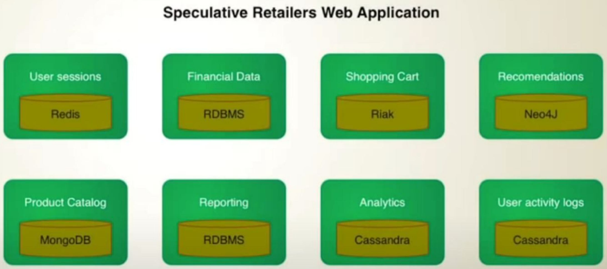

# Databases

It doesn't makes sense to talk about database (rdbms vs nosql) if we dont know QPS . If we have less than 10k-20k/sec write requests we can use even not sharded rdbms. If we have to support 100k/sec write requests it makes sense to start talk about noSql.

- RDBMS vs Columnar vs KV
  - [https://docs.microsoft.com/en-us/azure/architecture/guide/technology-choices/data-store-overview](https://docs.microsoft.com/en-us/azure/architecture/guide/technology-choices/data-store-overview)
  - Dzone articles are really good at these. You can learn a lot from there about the types of databases, when to use realtime or graph or kv databases and much more
  - YT [Introduction to NoSQL • Martin Fowler • GOTO 2012](https://www.youtube.com/watch?v=qI_g07C_Q5I&ab_channel=GOTOConferences)

## Sharding

[https://vitess.io/docs/15.0/reference/features/sharding/](https://vitess.io/docs/15.0/reference/features/sharding/) - for MySQL

## Shard Size

how much is typically the max or recommended size of each shard of say MySQL or for PostgreSQL ? This will help me estimate the number of shards required given that say I need to store 1 PB of data.

The link below in "Data Sharing" claims that the avg shard size ranges from 20 to 40 GB. Perhaps this is for MySQL.
[https://www.codercrunch.com/design/634265/designing-instagram#mcetoc_1dv10vl8s1l](https://www.codercrunch.com/design/634265/designing-instagram#mcetoc_1dv10vl8s1l)

## Million Records report

Let's say there is a table which has millions of records and records get updated frequently in that table. If you had to build a report for end users to show the statics of each hour, what would be your approach. Keep performance in mind since table has huge number of records.

It can be done in may ways. Each will have its own pros and cons:

1. Complex Indexing with tradeoff in write performance and less extensible in case any change is needed in report due to cost of reindexing.
2. Create multiple replicas and serve report by any replica only. This might work but if read txn is not implemented optimally may lead to replication lag and can affect the overall perf.
3. View in db, this wont be managable and less extensible. For critical db , views are usually not appreciated.
4. Send the metrics to timeseries monitoring db like prometheus. Not sure if this is right use case for prometheus and may require metrics to be published explicity from write path or prom will have read from slave. Both the ways addition of code is making it less modular in my view.
5. These days DBs can emit change event in the form of stream in async. We can enable these stream of updates. Write a consumer for these updates stream of event. Patch the update in some cold storage and let the user design amd customize their own report in cold storage or write an api for report powered by cold storage. This approach will not touch any code in write path hence no performance degradation in write path and events are sent async so no read performace degragation of db. All we might need is to scale the DB config as per event stream requirement.

## Other References

- [How Discord stores billions of messages](https://discord.com/blog/how-discord-stores-billions-of-messages)
- [How Discord indexes billions of messages](https://discord.com/blog/how-discord-indexes-billions-of-messages)
- YT [Types of NoSQL Databases | Why you should learn NoSQL before your next System Design Interview](https://www.youtube.com/watch?v=Tkr_2Hl8StE)
